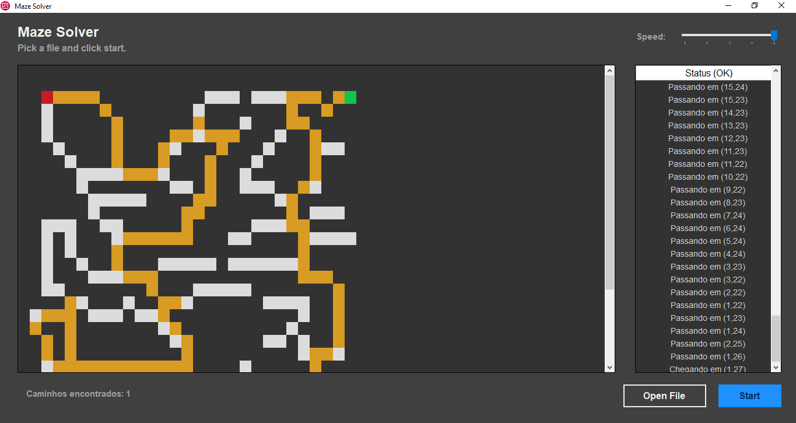

# maze-backtracking

> A maze solver algorithm using backtracking.

This project was made for Data Structures II subject. It presentes a text file reader, that reads a maze composed of # characters(wall), blank spaces (path), S(end) and I(start). Then, the algorithm is capable of finding paths that solve the maze, or detecting a maze with no solution. This project uses backtracking with stacking as its main algorithm. 

## Installation

You can download project dependencies. Then, you can run it in and IDE or text editor. The text files to test the project are inside the tests folder.

## Meta

Copyright (c) Eduardo Migueis and Rodrigo Smith 2020

Distributed under the MIT license. See `LICENSE` for more information.

[https://github.com/edumigueis/maze-backtracking](https://github.com/edumigueis/)
